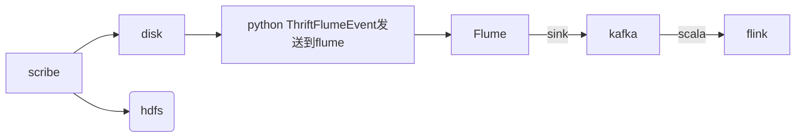

**大体流程：**

* python readlog 读取本地日志文件发送到flume(本测试基于原有项目，原有项目是有scribe接收日志存到本地。正式项目flume直接读取本地文件 source改为直接监控日志文件 a1.sources.r1.type = exec, a1.sources.r1.command = tail -F /var/log/secure)

* flume sink 数据到kafka

* flink  scala消费kafka

* 存入到redis

* django展示

<!-- more -->

>这里原应有一个流程图，但是不知道为何markdown不支持flow流程图




**本机系统：**

```
Ubuntu 16.04
conda环境下的python 3.7
```

**需要安装的环境：**

```
jdk1.8.0_202，scala 2.11.6 ，zookeeper-3.4.5，kafka_2.11-2.3.0，flume-1.8.0，flink-1.8.0
```
 
## <a name="fenced-code-block">1.安装java环境</a>
* 这里安装1.8

>环境存放到 cd /opt/

* 下载 wget https://repo.huaweicloud.com/java/jdk/8u202-b08/jdk-8u202-linux-x64.tar.gz

  (这里是用华为的镜像地址下载，oracle需要登陆账号)

* 解压到指定目录 tar -zxvf jdk-8u202-linux-x64.tar.gz

* vim ~/.bashrc  添加环境变量如下

```
export JAVA_HOME=/opt/jdk1.8.0_202  ## 这里要注意目录要换成自己解压的jdk 目录
export JRE_HOME=${JAVA_HOME}/jre
export CLASSPATH=.:${JAVA_HOME}/lib:${JRE_HOME}/lib
export PATH=${JAVA_HOME}/bin:$PATH
```

立即生效
source ~/.bashr

验证 java -version

## <a name="fenced-code-block">2.安装scala</a>
* 这里安装2.11版本

* spark和scala版本对应关系: spark1.6.2--scala2.10 spark2.0.0--scala2.11
本机还要安装spark2.0所以这里安装的是2.11.6

```
wget https://downloads.lightbend.com/scala/2.11.6/scala-2.11.6.tgz

tar -zxvf scala-2.11.6.tgz -C /opt/scala-2.11.6

vim ~/.bashrc

source ~/.bashrc

添加环境变量如下
export SCALA_HOME=/opt/scala-2.11.6
export PATH=$PATH:${SCALA_HOME}/bin

验证 scala -version
```

## <a name="fenced-code-block">3.安装zookeeper</a>
```
下载 wget http://archive.apache.org/dist/zookeeper/zookeeper-3.4.5/zookeeper-3.4.5.tar.gz

解压 tar -zxvf zookeeper-3.4.5.tar.gz -C /opt/zookeeper-3.4.5

进入解压目录  cd /opt/zookeeper-3.4.5/conf/
```
* 拷贝配置文件 cp zoo_sample.cfg  zoo.cfg

* vim zoo.cfg 添加如下内容

```
修改zookeeper数据存放地址，dataDir,dataLogDir

dataDir=/data/zookeeper/data
dataLogDir=/data/zookeeper/log
```

* 新建添加的zk数据目录

```
mkdir /data/zookeeper/data
mkdir /data/zookeeper/log
在/data/zookeeper/data 目录新建一个myid文件，内容为1，代表服务器的编号是1
```


* vim /etc/profile    添加环境变量


```
export ZOOKEEPER_HOME=/opt/zookeeper-3.4.5
export PATH=.:$ZOOKEEPER_HOME/bin:$JAVA_HOME/bin:$PATH
```

* source /etc/profile 立即生效

* 进入zk解压目录 `cd /opt/zookeeper-3.4.5`

* 启动  `bin/zkServer.sh  start`  此命令会在当前目录创建日志文件

>输出以下代表已启动正常，如有错误查看当前目录日志 zookeeper.out

>JMX enabled by default
Using config: /opt/zookeeper-3.4.5/bin/../conf/zoo.cfg
Starting zookeeper ... STARTED

查看启动状态：
 
* `bin/zkServer.sh status`

输出：

>JMX enabled by default
Using config: /opt/zookeeper-3.4.5/bin/../conf/zoo.cfg
Mode: standalone

## <a name="fenced-code-block">4.安装kafka</a>


* 这里安装 2.3.0 

* kafka_2.11-2.3.0  2.11为scala版本，kafka版本为2.3.0

* 下载 `wget https://www.apache.org/dyn/closer.cgi?path=/kafka/2.3.0/kafka_2.11-2.3.0.tgz`

* 解压 `tar -zxvf kafka_2.11-2.3.0.tgz -C /opt/kafka_2.11-2.3.0`

* 添加环境变量

```
vi ~/.bash_profile

export KAFKA_HOME=/opt/kafka_2.11-2.3.0

export PATH=$KAFKA_HOME/bin:$PATH
```

立即生效 `source ~/.bash_profile`


* kafka需要使用Zookeeper,所以需要启动Zookeeper服务,上面的操作就已经启动了Zookeeper服务
如果没有的话,可以使用kafka自带的脚本启动一个简单的单一节点Zookeeper实例
```
cd /opt/kafka_2.11-2.3.0/
bin/zookeeper-server-start.sh config/zookeeper.properties
```

* 现在启动kafka(前台执行，会打印日志)  `bin/kafka-server-start.sh config/server.properties`

后台执行
```
//配置了环境变量,1代表标准输出,2代表错误输出,把2重定向到标准输出1需要使用&,最后的&表示后台运行
nohup bin/kafka-server-start.sh config/server.properties > kafka_start.log 2>&1 & 
```

* 创建一个主题,只使用单个分区一个复本
`bin/kafka-topics.sh --create --zookeeper localhost:2181 --replication-factor 1 --partitions 1 --topic test`

* 启动生产者发送消息

`bin/kafka-console-producer.sh --broker-list localhost:9092 --topic test`
>Hello Kafka

另开终端启动消费者进行消费信息

`bin/kafka-console-consumer.sh --bootstrap-server localhost:9092 --topic test`

消费者成功打印出
>Hello Kafka

kafka相关命令
```
//启动kafka
bin/kafka-server-start.sh config/server.properties 
//停止kafka
bin/kafka-server-stop.sh
//创建topic,--replication-factor指定副本个数,--partitions指定分区个数
bin/kafka-topics.sh --create --zookeeper localhost:2181 --replication-factor 1 --partitions 1 --topic test
//查看所有的topic信息
bin/kafka-topics.sh --list --zookeeper localhost:2181
//启动生产者
bin/kafka-console-producer.sh --broker-list your.host.name:9092 --topic test
//启动消费者
bin/kafka-console-consumer.sh --bootstrap-server your.host.name:9092 --topic test --from-beginning
//删除topic
bin/kafka-topics.sh --delete --zookeeper localhost:2181 --topic test
```

如果后期开发的话需要对kafka配置进行修改 server.properties

其他参数没有深究，其他配置可以参考官网说明

```
//用于区分broker,必须唯一
broker.id=0

//代理将向生产者和消费者宣传的主机名和端口。 如果没有设定，它将使用“listeners”的值。否则，它从java.net.InetAddress.getCanonicalHostName获得。
advertised.listeners=PLAINTEXT://外网ip:9092

//配置zookeeper的地址,zookeeper集群地址以逗号隔开
zookeeper.connect=localhost:2181

//配置数据存放目录
log.dirs=/data/kafka2.3
```

advertised.listeners是个坑，这里说明下，也是让自己长点记性

官方解释：
>Listeners to publish to ZooKeeper for clients to use, if different than the listeners above. 
In IaaS environments, this may need to be different from the interface to which the broker binds.
If this is not set, the value for listeners will be used.

下面是默认配置，没有修改：
```
#listeners=PLAINTEXT://:9092
#advertised.listeners=PLAINTEXT://your.host.name:9092
zookeeper.connect=localhost:2181
```

注释的两个参数，虽然注释了，但是通过介绍可以知道，这两个参数，可以通过java.net.InetAddress.getCanonicalHostName获得，也就是可以获取到127.0.0.1  这样的话，本机测试是可以正常消费和生产数据的，但外网不行。

经各种测试后发现，修改kafka的advertised.listeners 为外网ip 即可：
```
#listeners=PLAINTEXT://:9092
advertised.listeners=PLAINTEXT://外网ip:9092
zookeeper.connect=localhost:2181
```

## <a name="fenced-code-block">5.flume安装</a>
* Flume


```
wget http://archive.apache.org/dist/flume/1.8.0/apache-flume-1.8.0-bin.tar.gz
tar -zxvf apache-flume-1.8.0-bin.tar.gz
重命名 mv apache-flume-1.8.0-bin flume-1.8.0
```
添加环境变量
```
vi ~/.bash_profile
export FLUME_HOME=/opt/flume-1.8.0
export PATH=$PATH:$FLUME_HOME/bin
```
立即生效 `source ~/.bash_profile`

进入解压目录修改配置`cd /opt/flume-1.8.0/conf/`
`mv flume-env.sh.template flume-env.sh`

`vim flume-env.sh` 去掉注释，配置正确的java路径
`export JAVA_HOME=/opt/jdk1.8.0_202`

验证 `flume-ng version` 输出：
>Flume 1.8.0
Source code repository: https://git-wip-us.apache.org/repos/asf/flume.git
Revision: 99f591994468633fc6f8701c5fc53e0214b6da4f
Compiled by denes on Fri Sep 15 14:58:00 CEST 2017
From source with checksum fbb44c8c8fb63a49be0a59e27316833d
>
拷贝并修改配置`cp flume-conf.properties.template   flume-conf.properties`

使用官方配置,官方配置使用netcat源，更多源查看官方网站[https://flume.apache.org/releases/content/1.9.0/FlumeUserGuide.html#spooling-directory-source]([https://flume.apache.org/releases/content/1.9.0/FlumeUserGuide.html#spooling-directory-source](https://flume.apache.org/releases/content/1.9.0/FlumeUserGuide.html#spooling-directory-source))

```
#example.conf: A single-node Flume configuration

#Name the components on this agent
a1.sources = r1
a1.sinks = k1
a1.channels = c1

#Describe/configure the source
a1.sources.r1.type = netcat
a1.sources.r1.bind = localhost
a1.sources.r1.port = 44444

#Describe the sink
#打印内容到日志中
a1.sinks.k1.type = logger

#Use a channel which buffers events in memory
a1.channels.c1.type = memory
a1.channels.c1.capacity = 1000
a1.channels.c1.transactionCapacity = 100

#Bind the source and sink to the channel
a1.sources.r1.channels = c1
a1.sinks.k1.channel = c1

```

启动验证
`bin/flume-ng agent --conf conf --conf-file conf/flume-conf.properties --name a1 -Dflume.root.logger=INFO,console`

另起窗口输入,然后输入内容，前面的终端会输出内容，测试成功。
> telnet localhost 44444


* 这里要使用,Thrift源。因为项目中原本要兼容flume+scribe，新建配置 flume-thrift.properties,接收python发送过来的日志

```
tier1.sources  = source1
tier1.channels = channel1
tier1.sinks    = sink1

tier1.sources.source1.channels = channel1
tier1.channels.channel1.type   = memory
tier1.sources.source1.type = thrift
tier1.sources.source1.bind = 0.0.0.0
tier1.sources.source1.port = 4444

tier1.sources.source1.selector.type = multiplexing
tier1.sources.source1.selector.header = GAMENAME
tier1.sources.source1.selector.mapping.FSZHS = channel1

#配置sink下沉到kafka，kafka来消费数据
tier1.sinks.sink1.type = org.apache.flume.sink.kafka.KafkaSink
tier1.sinks.sink1.brokerList = localhost:9092
tier1.sinks.sink1.topic = test
tier1.sinks.sink1.serializer.class = kafka.serializer.StringEncoder
tier1.sinks.sink1.channel = channel1


tier1.channels.channel1.capacity = 5000
tier1.channels.channel1.transactionCapacity = 2000

#日志中打印出内容
#tier1.sinks.sink1.type = logger
#tier1.sinks.sink1.channel = channel1

```

关于selector参数的说明： 

它的type 有** Multiplexing **,** Replicating** , 这里是用selector来根据header的GAMENAME内容分发到对应的channel，暂时不做存储。（项目需要本地，hdfs分别一份，每个项目需要两个channel）

区别是：Replicating 会将source过来的events发往所有channel,而Multiplexing 可以选择该发往哪些channel

之前没有设置会出现`Thrift source %s could not append events to the channel.`

查阅资料,这和memory channel的另一个参数有关：

transactionCapacity，（The maximum number of events the channel will take from a source or give to a sink per transaction）表明source给channel、channel给sink一次发送的event个数，如果不设置，默认值为100。所以当我设置batchsize为100时，可以正确发送，但是超过100，就发送失败。

关于参数** transactionCapacity ** 和** capacity ** :

>a1.sinks.k1.hdfs.batchSize 官方解释:
>##number of events written to file before it is flushed to HDFS  
 >a1.channels.c1.capacity  官方解释 :  
 >#The maximum number of events stored in the channel
 >a1.channels.c1.transactionCapacity 官方解释 :   
 >#The maximum number of events the channel will take from a source or give to a sink per transaction

这三者之间的关系:

batchsize <=transactionCapacity<=capacity
## <a name="fenced-code-block"> 6.flink安装 </a>

```
wget https://archive.apache.org/dist/flink/flink-1.8.0/flink-1.8.0-bin-scala_2.11.tgz

解压 tar -zxvf apache-flume-1.8.0-bin.tar.gz
```
启动flink `bin/start-cluster.sh`
 
查看web [http://localhost:8081](http://localhost:8081)

* 测试   nc -l 9000 输入
>hello flink 

启动官方demo
`./bin/flink run examples/streaming/SocketWindowWordCount.jar --port 9000`

查看日志log目录下

`tail -f flink-root-taskexecutor-0-xxxxxxxxx.out `

输出：
> (hello,1)
> (flink,1)


至此环境搭建完成。